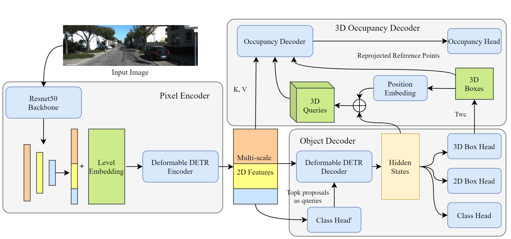

# OccupancyDETR: Making Semantic Scene Completion as Straightforward as Object Detection

Yupeng Jia*, Jie He*, Runze Chen, Fang Zha and Haiyong Luo

\* Equal contribution

[arxiv](https://arxiv.org/abs/2309.08504)

**This work is still under working!**

## Introduction

Visual-based 3D semantic occupancy perception (also known as 3D semantic scene completion) is a new perception paradigm for robotic applications like autonomous driving. Compared with Bird's Eye View (BEV) perception, it extends the vertical dimension, significantly enhancing the ability of robots to understand their surroundings. However, due to this very reason, the computational demand for current 3D semantic occupancy perception methods generally surpasses that of BEV perception methods and 2D perception methods. We propose a novel 3D semantic occupancy perception method, OccupancyDETR, which consists of a DETR-like object detection module and a 3D occupancy decoder module. The integration of object detection simplifies our method structurally - instead of predicting the semantics of each voxels, it identifies objects in the scene and their respective 3D occupancy grids. This speeds up our method, reduces required resources, and leverages object detection algorithm, giving our approach notable performance on small objects.

